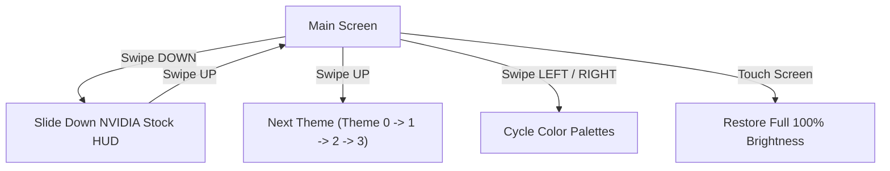

# 🚀 ESP32-S3 Info Station


An advanced, high-performance **Smart Desktop Info Station** built for the **LilyGO T-Display-S3** (ESP32-S3). Features 4 dynamic animated UI themes, capacitive touch gesture controls, real-time weather & telemetry, an interactive NVIDIA stock HUD, smart PWM power management, and automatic GitHub Over-The-Air (OTA) firmware updates.

Designed specifically to complement a **Red (front) & Purple (back)** 3D-printed enclosure.

---

## ✨ Features

- 🎨 **Red & Purple Cyber Aesthetic**: Specially tuned color palettes matching custom red & purple 3D-printed shells.
- ⚡ **4 Mind-Blowing UI Themes**:
  - **Theme 0: CyberHUD** — Futuristic cyberpunk grid dashboard with glowing reticles and dual telemetry panels.
  - **Theme 1: Minimal Modern** — Glassmorphic frosted cards with giant gradient digital clock.
  - **Theme 2: Synthwave 80s** — Retro neon sun, scanlines, and animated 3D perspective grid lines.
  - **Theme 3: Orbital Astro** — Deep space 3D warping starfield particles with revolving planetary seconds satellite.
- 📊 **Persistent Bottom Status Bar**: Always-there status bar across all themes displaying Wi-Fi RSSI, City name, Battery telemetry ($0-100\%$, charging state), and Firmware version / OTA progress.
- 📈 **Interactive Slide-Down NVIDIA Stock HUD**:
  - **Swipe Down** from top edge to open the Stock HUD popup.
  - **Swipe Up** to slide it back up off-screen.
  - Vector-rendered **Official NVIDIA Swirling Eye Emblem** (`nVIDIA GEFORCE`) and live sparkline price trend chart.
- 🔋 **Smart Power Management**:
  - **Gradual Brightness Fade**: Smooth ~400ms PWM fading between 100%, 30%, 5%, and blackout states.
  - **Auto Dimming**: Dims to 30% after 15s inactivity, 5% after 30s.
  - **Always-On Mode**: Screen remains at 100% full brightness while USB charging.
  - **Deep Sleep**: Long-press **Button 1** (Boot button, >1.2s) to enter ESP32-S3 Deep Sleep (~15µA standby current). Press Button 1 to wake up.
- 🌐 **Wi-Fi Web Setup Portal & NVS Credential Storage**:
  - Press **Button 2** (GPIO 14) to launch Captive Web Setup Portal (`ESP-InfoStation-Setup` at `192.168.4.1`) to configure Wi-Fi credentials without reflashing.
- 🔄 **Automatic GitHub OTA Firmware Updates**:
  - Automatically polls `version.json` on [GitHub Releases](https://github.com/dexterpengji/esp-info-station/releases).
  - Downloads and flashes `firmware.bin` over-the-air whenever a new version is detected.

---

## 🛠️ Hardware Specification & Pinout

| Peripheral | ESP32-S3 GPIO | Description |
| :--- | :--- | :--- |
| **ST7789 LCD** | Parallel Bus | 320x170 Color TFT Display |
| **LCD Power** | `GPIO 15` | Peripheral & LCD Power Enable |
| **LCD Backlight** | `GPIO 38` | Hardware PWM Backlight Dimming |
| **Touch Screen** | `I2C` (SDA: `18`, SCL: `17`) | CST816 / CST328 Capacitive Touch Controller |
| **Battery ADC** | `GPIO 4` | Resistor Divider 1:2 Voltage Sensing |
| **Button 1** | `GPIO 0` | Boot Button (Short Press: Wake / Brightness, Long Press: Deep Sleep) |
| **Button 2** | `GPIO 14` | User Button (Toggle Wi-Fi Setup Portal) |

---

## 🖐️ Gesture Controls



---

## 🚀 Getting Started

### Prerequisites

- [PlatformIO IDE](https://platformio.org/) (VS Code extension or CLI)
- LilyGO T-Display-S3 development board

### Installation

1. **Clone the Repository**:
   ```bash
   git clone https://github.com/dexterpengji/esp-info-station.git
   cd esp-info-station
   ```

2. **Configure Secrets**:
   Copy the secrets template to `secrets.h`:
   ```bash
   cp include/secrets.h.example include/secrets.h
   ```
   Edit `include/secrets.h` with your Wi-Fi SSID & Password:
   ```cpp
   #define WIFI_SSID     "Your_WiFi_SSID"
   #define WIFI_PASSWORD "Your_WiFi_Password"
   ```

3. **Build & Flash**:
   ```bash
   # Build Firmware
   pio run

   # Upload to LilyGO T-Display-S3
   pio run --target upload
   ```

---

## 📦 Automatic GitHub OTA Updates

This project supports seamless OTA firmware updates hosted directly on GitHub:

1. Compile firmware using PlatformIO (`pio run`).
2. Create a Release on GitHub (e.g. `v1.1.0`).
3. Attach `.pio/build/lilygo-t-display-s3/firmware.bin` as a release asset.
4. Update `version.json` in your repository:
   ```json
   {
     "version": "v1.1.0",
     "url": "https://github.com/dexterpengji/esp-info-station/releases/download/v1.1.0/firmware.bin",
     "notes": "New feature updates"
   }
   ```
5. Your ESP32-S3 info station will automatically detect the release, show an `OTA Progress` overlay, flash the binary, and reboot!

---

## 📄 License

Distributed under the MIT License. See `LICENSE` for more information.

---

<p align="center">Made with ❤️ for LilyGO T-Display-S3 by Dexter Pengji</p>
